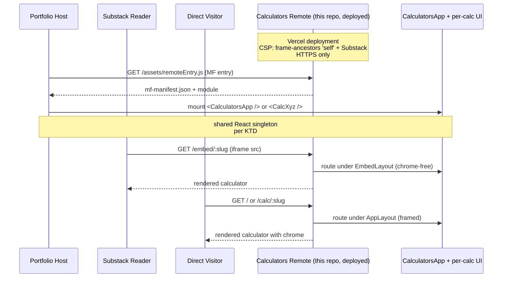

# Calculators Microfrontend — React Rebuild

## Summary

Build the React calculators microfrontend as a pnpm monorepo using `@module-federation/vite` (MF 2.0) for portfolio integration, with a sibling non-federated harness app for local dev. Six fully-independent calculator packages (LGS DSCR and Olamina DSCR are deliberately not extracted to a shared core), three shared infrastructure packages, a federated shell app, and Vercel deployment with `frame-ancestors` CSP for Substack iframe embeds. Strict red→green→refactor TDD on pure logic with prefixed commits; pragmatic RTL coverage on UI.

---

## Problem Frame

The HTML calculators at `../old_calcs/` are functional but generate no signal for the engineering audience the portfolio is aimed at — see [origin](../brainstorms/2026-05-01-calculators-microfrontend-requirements.md) for full motivation and product framing. This plan covers the technical execution: monorepo bootstrap, shared infrastructure, six greenfield calculator rewrites against HTML behavior references, Module Federation integration, deployment with Substack-friendly CSP, and a cross-cutting accessibility pass.

---

## Requirements

Carried forward from origin (R-IDs preserved); see origin for full text and rationale.

**Architecture & composition** — R1, R2, R3, R4, R5
**Embed surfaces** — R6, R7, R8
**Functional programming discipline** — R9, R10, R11, R12
**TDD discipline** — R13, R14, R15, R16
**Migration & inventory** — R17, R18 (inventory I1–I6 in origin)
**Accessibility** — R19 (tightened in KTD #16 below)
**Deployment & integration** — R20, R21

**Origin actors:** A1 (Portfolio visitor), A2 (Substack reader), A3 (Direct visitor)
**Origin flows:** F1 (Portfolio composition via federation), F2 (Substack iframe embed), F3 (Direct visit)
**Origin acceptance examples:** AE1 (covers R6, R7), AE2 (covers R4, R5), AE3 (covers R11), AE4 (covers R13), AE5 (covers R7, R20)

---

## Scope Boundaries

Carried from origin (single list — origin is Deep-feature). Plan-time additions are marked *(plan)*.

- single-spa, qiankun, or other runtime composition systems beyond Module Federation
- fp-ts, Effect, or any orthodox-FP effect-system library
- Algebraic data types (Either, Option, Task) for error or effect handling
- Server-side rendering, Next.js, or Remix
- Web Components / custom elements as the embed primitive
- A documentation/blog-post deliverable about the rebuild process itself
- Multi-repo splitting (each calc as its own repo)
- Telemetry, analytics, A/B testing
- Backwards compatibility with existing HTML calculator URLs, markup, or DOM IDs
- Internationalization beyond a single language
- Version-pinning the federation entry URL
- Distributed type-sharing infrastructure beyond MF 2.0's built-in auto-types
- CI-enforced pure-function ratio at v1
- *(plan)* `@originjs/vite-plugin-federation` — superseded by `@module-federation/vite` (MF 2.0)
- *(plan)* `@calc/dscr-core` shared-math package — DSCR I3/I4 deliberately implemented as two independent packages with math copy-pasted; drift risk bounded by TDD coverage in both
- *(plan)* Squash-merge on calculator feature branches (incompatible with TDD-history visibility per AE4)
- *(plan)* `localStorage` / URL / sessionStorage state at v1
- *(plan)* `postMessage`-based dynamic iframe resize protocol at v1
- *(plan)* `eslint-plugin-functional` or any FP-enforcing linter at v1
- *(plan)* CI-enforced coverage thresholds at v1
- *(plan)* Storybook or component playground (the harness app fills the dev-mount role)
- *(plan)* Visual regression tests at v1
- *(plan)* URL-shareable links carrying calculator inputs (privacy posture for financial calcs)

---

## Context & Research

### Relevant Code and Patterns

- **Repo is greenfield** (research confirmed): only `LICENSE` and a 40-byte `README.md` at the root. No existing patterns to extend; everything is created from scratch.
- **HTML originals** at `../old_calcs/` (copied to `reference/html-originals/` in U1): six single-file HTMLs, vanilla JS in inline `<script>`, inline `<style>`, no build step. **Three (I1 Birchwood, I5 LVT, I6 Surry County) use Chart.js 4.4 via jsDelivr CDN; three (I2 EU5, I3 LGS, I4 Olamina) are pure form/calc.** I2's "Net Profit Over Time" is a numeric table in the original, not a chart — verified against the source.
- **DSCR pair (I3 + I4) math overlap:** both files share `monthlyPayment`, `calc()` flow, and PITIA composition. The only material divergence is Olamina's `getKitPrice(modelId)` addon. This was the input that drove KTD #4 (no shared core).
- **Brainstorm doc** at `docs/brainstorms/2026-05-01-calculators-microfrontend-requirements.md` is the canonical product spec. Currently uncommitted in git; U1 commits it as part of the foundation step.

### Institutional Learnings

- None present (`docs/solutions/` does not exist).

### External References

- `@module-federation/vite` (MF 2.0) — official next-gen plugin; supersedes the stalled `@originjs/vite-plugin-federation` which lacks Vite 7 support a year after Vite 7 shipped
- Vite 7.x and React 19.2 as the current stable line in 2026
- Vitest 4.x with "projects" mode (the older "workspace" terminology is deprecated)
- pnpm 10.x with `pnpm-workspace.yaml`
- CSP `frame-ancestors` (preferred over deprecated `X-Frame-Options`); cannot be set via `<meta>`, must be HTTP header

---

## Key Technical Decisions

1. **Federation tooling: `@module-federation/vite` (MF 2.0).** Originjs has stalled (no Vite 7 support); MF 2.0 is the dominant 2026 choice with manifest mode and auto type-sharing built in. (Resolves origin Deferred-to-Planning Q on federation tooling.)
2. **Local dev workflow: separate `apps/harness/` app** mounting the calculator surface directly. Rationale: isolates the "mountable in any host" contract from the federated production build, which keeps calc-UI iteration on a clean Vite dev server with normal HMR. The plugin's `dev` block (e.g. `dev: { remoteHmr: true }`) is supported but optimized for host-side reloading of remote changes — not what we need for local calc iteration. The harness is a single `src/main.tsx` consuming the calc surface as plain React.
3. **Embed URL contract: `/embed/:slug` route prefix** for chrome-free per-calc views; `/calc/:slug` for the framed mode; `/` for the home/index page. Direct visitors to `/embed/*` get the chrome-free render — no detection of parent context. Route-level layouts (`EmbedLayout` vs `AppLayout`) avoid the post-hydration flash that a `?embed=1` query-param check would cause. (Resolves origin Deferred-to-Planning Q on URL contract.)
4. **DSCR I3/I4 as two independent packages with math copy-pasted.** No `@calc/dscr-core`. Drift risk bounded by full TDD coverage in both packages — a real bug surfaces as test failures in both, and the fix is a 30-second copy. Two clean implementations also sidestep the "configuration soup" failure mode shared cores tend toward when brand variants accumulate. (Resolves origin Deferred-to-Planning Q on DSCR shared-core treatment.)
5. **Federation expose surface includes `<CalculatorsLoadError />`** alongside `<CalculatorsApp />`, `<CalculatorsRoutes />` (see KTD #20), and per-calc components. The portfolio host renders this component when remote fetch fails. **Sanitization contract:** the optional `error` prop is typed as `unknown`; the component renders only `String(error)` (or `error.message` for `Error` instances) as text content — never via `dangerouslySetInnerHTML`, never as raw HTML. U2 includes a test asserting that `<script>alert(1)</script>` passed as `error` renders as escaped text.
6. **Pure-function heuristic: function-count manual review checklist at v1.** No tooling, no CI gate. The 80% target is enforced via PR review. (Resolves origin Deferred-to-Planning Q.)
7. **Commit convention: prefixed `red:` / `green:` / `refactor:` messages** with no squash on feature branches. Makes AE4 verifiable by scanning `git log`. (Resolves origin Deferred-to-Planning Q.)
8. **State persistence: none at v1.** No `localStorage`, no URL params carrying inputs. Privacy positive for financial calcs (I3, I4, I5).
9. **Iframe sizing: per-calc fixed `min-height`** documented at the calc level. `postMessage`-based resize protocol deferred until clipping is observed in production.
10. **Deployment: Vercel.** HTTPS by default, simple CSP via `vercel.json`, free portfolio-tier hosting. Cloudflare Pages is the noted fallback if Vercel limits hit. (Resolves origin Deferred-to-Planning Q on deployment target.)
11. **CSP: multi-directive HTTP header** set via `vercel.json`:
    - `frame-ancestors 'self' https://*.substack.com https://substack.com` — controls iframe embedding (the Substack surface). Not `X-Frame-Options`; not via `<meta>` (browsers ignore `frame-ancestors` from meta).
    - `default-src 'self'` and `script-src 'self'` — make the "inputs don't leave your browser" claim transport-enforced rather than UI-only, and catch any accidental CDN reference during Chart.js porting (the originals load Chart.js via jsDelivr; the rewrite bundles it from npm).
    - `connect-src 'self'` — no outbound fetches at v1.
    - `frame-ancestors` and CORS are orthogonal: `frame-ancestors` controls who can iframe; CORS (KTD #10) controls who can fetch the federation entry. Both must be set explicitly. The Substack `*.substack.com` wildcard is intentionally permissive — Substack does not expose per-publication subdomain in an allowlistable way, so any Substack user can iframe (low practical impact: no auth, no stored state).
12. **Vitest "projects" mode** with shared base via `vitest.shared.ts` + `mergeConfig` in each leaf config. Domain packages run in `node` env; UI packages in `jsdom`. Enforces the no-React-in-domain rule at the test runner level.
13. **Per-package coverage: filtered runs** (`pnpm -r --filter <pkg> test:coverage`) using the v8 provider. Target floor of 80% line coverage on domain modules; UI packages use coverage as guidance, not gate. (Resolves origin Deferred-to-Planning Q on coverage policy.)
14. **MF shared deps: React + ReactDOM as `singleton` with trailing-slash patterns** (`react/`, `react-dom/`) to cover `react/jsx-runtime` and avoid the classic two-React "Invalid hook call" bug.
15. **pnpm hoisting: `.npmrc` with `public-hoist-pattern[]=*react*`** so MF's shared-deps resolver sees the same React across every package; prevents transitive React from hiding in unhoisted dependencies.
16. **ARIA live regions for computed results: shared `AriaLive` wrapper in `@calc/ui`** that every calc routes its primary results through. Tightens origin R19 by closing the spec-flow-analyzer's screen-reader announcement gap.
17. **HTML originals: copied into `reference/html-originals/` in U1.** The repo becomes self-contained — readers can compare old vs new without leaving the repo. (Resolves origin Deferred-to-Planning Q on HTML originals location.)
18. **Privacy disclosure on financial calcs (I3 LGS DSCR, I4 Olamina DSCR only):** each renders an inline "Inputs don't leave your browser" line in its UI. Reinforces KTD #8 and KTD #11's `script-src 'self'` (the claim is transport-enforced, not just a UI assertion). Scope previously included I5; dropped after document review surfaced the inconsistency — I5 is structural municipal-policy analysis (like I1 and I2, which also don't carry the disclosure), not personal-loan input like I3/I4.

19. **CSS strategy: vanilla CSS Modules (`*.module.css`) co-located with components.** Promoted from the brainstorm's "Deferred to Implementation" because it blocks U2 (layouts) and U3 (`@calc/ui` primitives). Rationale: zero framework lock-in, native Vite + TS support without extra plugins, scoped class isolation per package, plays cleanly with the per-package vitest projects split. No Tailwind v4 (avoids ecosystem-version risk and learnability tax for a portfolio reader); no styled-components (runtime cost + RSC posture is unsettled in 2026).

20. **Federation router shape: `<CalculatorsApp />` keeps its router; expose adds `<CalculatorsRoutes />` (no router wrapper) for federated hosts.** The portfolio host almost certainly has its own React Router context; nesting `<BrowserRouter>` inside another router throws in react-router 7 ("cannot render `<Router>` inside another `<Router>`"). Resolution: `<CalculatorsApp />` self-wraps `<BrowserRouter>` and is the canonical mount for direct visit, iframe, and the harness app. `<CalculatorsRoutes />` is exposed via federation for hosts that already provide a router — it renders `<Routes>` directly under the host's router. AE2's "host federates `<CalculatorsApp />`" is rephrased to "host federates `<CalculatorsRoutes />` and supplies the router." `docs/portfolio-integration.md` documents the choice criterion.

21. **Workspace dep wiring: `apps/harness` consumes `apps/remote` as a workspace package.** `apps/remote/package.json` declares `"name": "@apps/remote"` with `"exports": { "./CalculatorsApp": "./src/CalculatorsApp.tsx", "./CalculatorsRoutes": "./src/CalculatorsRoutes.tsx" }`. Harness adds `"@apps/remote": "workspace:*"` and uses `vite-tsconfig-paths` (or Vite's source-condition support) so TS sources resolve cleanly without a build step. Avoids relative imports across `apps/`, which fight workspace tooling.

22. **Dependency placement:** React, ReactDOM, TypeScript, Vitest, `@vitest/coverage-v8`, `@vitejs/plugin-react`, and ESLint at the **workspace-root `devDependencies`** (singletons reinforced by KTD #15's hoist pattern). Per-package `package.json`s declare React as `peerDependencies` (so MF's shared resolver sees the same version) plus their own runtime deps (e.g. `chart.js` only in `@calc/charts` and chart-bearing calc packages). Calc packages declare `"@calc/ui": "workspace:*"`, `"@calc/domain-utils": "workspace:*"`, etc.

23. **Federation public-API contract test lands in U4, not U10.** U4 (Surry County, the pattern-setter) includes a contract test asserting that `import('calc-surry-county-offer').then(m => m.default)` returns a renderable React component without top-level side effects. Pulls federation surface discovery forward so U5–U9 inherit the validated contract; U10 then becomes "wire it up" rather than "discover it works."

24. **Shared test fixtures per calc:** each calc package writes a `tests/fixtures.ts` that documents 5+ canonical input sets and their expected outputs (derived from manual reads of the HTML original at `reference/html-originals/<calc>.html`). The `domain.test.ts` and the cross-package agreement test (U6) consume these fixtures rather than inventing inputs ad-hoc. Makes AE3 (numeric parity) and AE4 (TDD evidence) verifiable rather than circular.

25. **CORS allowlist is a deployment pre-condition, not post-integration cleanup.** U11 will not deploy production until the portfolio host's origin is captured into `vercel.json`'s `Access-Control-Allow-Origin` header. The deployment runbook gates merge-to-production on a `curl -I` verification that headers are correct. Dev/preview deploys may use a permissive value; production requires specificity.

---

## Open Questions

### Resolved During Planning

- DSCR I3/I4 shared-core treatment → KTD #4 (independent packages)
- Federation tooling pick → KTD #1 (`@module-federation/vite`)
- Embed URL contract → KTD #3 (`/embed/:slug`)
- Pure-function heuristic → KTD #6 (manual checklist)
- Commit convention → KTD #7 (prefixed messages, no squash)
- Coverage policy → KTD #13 (per-package filtered runs)
- Deployment target → KTD #10 (Vercel)
- HTML originals location → KTD #17 (`reference/html-originals/`)
- Direct-visit-to-`/embed/*` behavior → KTD #3 default (renders chrome-free)
- State persistence policy → KTD #8 (none at v1)
- Federation failure contract → KTD #5 (`<CalculatorsLoadError />` with sanitization contract)
- Iframe sizing strategy → KTD #9 (fixed `min-height` per calc)
- ARIA live regions for computed results → KTD #16 (shared `AriaLive` wrapper)
- CSS strategy → KTD #19 (vanilla CSS Modules)
- Federation router shape → KTD #20 (`<CalculatorsApp />` self-routes; `<CalculatorsRoutes />` exposed for federated hosts)
- Harness ↔ remote import mechanism → KTD #21 (workspace package with `exports`)
- Dependency placement → KTD #22 (root devDeps, per-package peerDeps for React)
- Federation contract test placement → KTD #23 (lands in U4 pattern-setter)
- Test fixtures convention → KTD #24 (`tests/fixtures.ts` per calc, derived from HTML originals)
- CORS tightening gate → KTD #25 (deployment pre-condition, not cleanup)
- CSP scope → KTD #11 (multi-directive; `frame-ancestors` + `default-src` + `script-src` + `connect-src`)
- Privacy disclosure scope → KTD #18 (I3, I4 only — I5 dropped)

### Deferred to Implementation

- Exact home-model lists for LGS and Olamina DSCR (extracted from HTML originals during U5 / U6)
- Exact Chart.js options for I1, I5, I6 (mirror originals during implementation; tweak only if visually broken)
- Federation manifest URL post-deploy (assigned in U11; written into `docs/portfolio-integration.md`)
- Specific portfolio-host origin for CORS allowlist (captured before U11 production deploy per KTD #25; permissive value acceptable for preview deploys only)
- Exact preset definitions for each calc (mirror HTML originals during the corresponding unit)

### Strategic Concerns Surfaced During Document Review

These are premise-level concerns flagged by document review that the plan did not auto-resolve. They are surfaced here for the user to consider before or during implementation; each represents a judgment call rather than a factual fix.

- **MF complexity vs portfolio signal.** The federation apparatus is the loudest thing in the repo and the success criterion ("5 minutes to identify FP/TDD discipline") fights it. The README is currently treated as a stub replacement; consider promoting it to a load-bearing artifact that links directly to one example `domain.ts` (FP exemplar) and a representative `git log` range showing red/green/refactor commits. Without that, reviewers may bounce off MF infrastructure before reaching the discipline being demonstrated.
- **Six calcs vs three calcs for v1.** U4 establishes the pattern; U5–U9 are five demonstrations of the same pattern. Opportunity cost is real (each calc is parity testing + RTL + presets + chart wiring where applicable). A defensible cut: ship U4 + U5 (DSCR) + U9 (Birchwood — chart-bearing). Defer U6, U7, U8 to a "more calculators" batch only if portfolio integration validates demand. The plan currently ships all six; weighing whether that's the right v1 scope is a user call.
- **DSCR cross-package agreement test only covers zero-kit-price overlap.** Drift in non-overlapping math (Olamina's discount-applied principal, etc.) is structurally invisible to the U6 test. KTD #24's shared fixtures convention partially addresses this by ensuring both DSCR packages consume documented input/output pairs, but the user should weigh whether stronger cross-package agreement is warranted (e.g., a shared `reference/fixtures/dscr.fixtures.ts` both DSCR packages must consume).
- **Portfolio-host MF compatibility is load-bearing but unverified.** The Risk Analysis rates this Medium/Medium; in reality the entire MF half of the architecture (KTDs #1, #2, #5, #14, #15, #20, #21, #25 and U10) collapses if the host can't consume MF or doesn't run React. This is a 1-hour verification on the user's own portfolio. Consider running it as an effective U0 prerequisite before sinking effort into U10.
- **HomePage and AppLayout header content unspecified.** The discovery surface for direct visitors (F3) is content-empty in the plan. Without design direction, AI-slop risk is real (generic SaaS feature-card grid). Consider adding even a one-paragraph spec for the HomePage (calc index ordering, descriptions, navigation model) and the AppLayout header (site name, nav, back-link expectations) before U2 implementation begins.
- **Iframe-everywhere alternative not explicitly compared.** Substack already uses iframes; the portfolio could too. Trades AE2's "single React copy" guarantee for collapsing U10 federation work, the harness/remote split, and the shared-deps risk surface. The plan committed to MF in brainstorm; surfacing the alternative now is for awareness, not redirection — pivoting is still possible if portfolio-host verification surprises in the wrong direction.
- **U12 cross-cutting accessibility audit risks rework.** Shared `AriaLive` / `FormField` issues found at U12 propagate fixes back to U3 and across all six calcs. Consider adding a lightweight axe-core baseline at the end of U4 (pattern-setter) before U5–U9 inherit the substrate, so systemic issues surface early. U12 then becomes confirmation rather than discovery.

---

## Output Structure

```text
calculators/
├── .npmrc                                # public-hoist-pattern[]=*react*
├── .nvmrc                                # Node 20+
├── .gitignore
├── .editorconfig
├── eslint.config.js                      # flat config
├── prettier.config.js
├── package.json                          # workspace root + scripts
├── pnpm-workspace.yaml
├── tsconfig.base.json
├── vitest.shared.ts                      # shared Vitest base config
├── vitest.config.ts                      # root projects config
├── vercel.json                           # frame-ancestors CSP for Substack
├── README.md                             # replaces the 40-byte stub
├── LICENSE                               # preserved
├── apps/
│   ├── remote/                           # Federated shell app (MF expose)
│   │   ├── package.json
│   │   ├── vite.config.ts                # federation config in U10
│   │   ├── tsconfig.json
│   │   ├── vitest.config.ts
│   │   ├── index.html
│   │   ├── src/
│   │   │   ├── main.tsx
│   │   │   ├── CalculatorsApp.tsx        # self-routing (BrowserRouter)
│   │   │   ├── CalculatorsRoutes.tsx     # router-less variant for federated hosts
│   │   │   ├── CalculatorsLoadError.tsx  # sanitization-safe error boundary
│   │   │   ├── routes.tsx
│   │   │   ├── exposes/
│   │   │   │   └── index.ts              # federation surface (U10)
│   │   │   ├── layouts/
│   │   │   │   ├── AppLayout.tsx         # framed
│   │   │   │   └── EmbedLayout.tsx       # chrome-free
│   │   │   └── pages/
│   │   │       ├── HomePage.tsx
│   │   │       └── NotFoundPage.tsx
│   │   └── tests/
│   └── harness/                          # Non-federated dev mount
│       ├── package.json
│       ├── vite.config.ts
│       ├── tsconfig.json
│       ├── index.html
│       └── src/main.tsx
├── packages/
│   ├── domain-utils/                     # formatters + validators (pure)
│   │   ├── package.json
│   │   ├── vitest.config.ts              # env: node
│   │   ├── src/
│   │   │   ├── format/
│   │   │   ├── validate/
│   │   │   └── index.ts
│   │   └── tests/
│   ├── ui/                               # FormField, ResultDisplay, AriaLive
│   │   ├── package.json
│   │   ├── vitest.config.ts              # env: jsdom
│   │   ├── src/
│   │   │   ├── FormField.tsx
│   │   │   ├── NumberInput.tsx
│   │   │   ├── PercentInput.tsx
│   │   │   ├── CurrencyInput.tsx
│   │   │   ├── ResultDisplay.tsx
│   │   │   ├── AriaLive.tsx
│   │   │   └── index.ts
│   │   └── tests/
│   ├── charts/                           # Chart.js wrapper
│   │   ├── package.json
│   │   ├── vitest.config.ts              # env: jsdom
│   │   ├── src/
│   │   │   ├── BarChart.tsx
│   │   │   ├── LineChart.tsx
│   │   │   └── index.ts
│   │   └── tests/
│   ├── calc-surry-county-offer/          # I6 — pattern-setter
│   │   ├── package.json
│   │   ├── vitest.config.ts              # multi-env via projects
│   │   ├── src/
│   │   │   ├── domain.ts                 # pure (node env)
│   │   │   ├── Component.tsx             # UI (jsdom env)
│   │   │   └── index.ts                  # public API
│   │   └── tests/
│   ├── calc-lgs-dscr/                    # I3
│   ├── calc-olamina-dscr/                # I4
│   ├── calc-eu5-loan/                    # I2
│   ├── calc-winston-salem-lvt/           # I5
│   └── calc-birchwood-rent-sell/         # I1
├── reference/
│   └── html-originals/                   # six HTML files copied from ../old_calcs/
└── docs/
    ├── brainstorms/
    │   └── 2026-05-01-calculators-microfrontend-requirements.md
    ├── plans/
    │   └── 2026-05-01-001-feat-calculators-microfrontend-react-rebuild-plan.md
    ├── portfolio-integration.md          # MF host-side contract (U10)
    ├── deployment.md                     # deploy runbook (U11)
    └── accessibility.md                  # audit report (U12)
```

This tree is a scope declaration showing the expected output shape. The implementer may adjust file layout where implementation reveals a better local structure; per-unit `**Files:**` sections remain authoritative for what each unit creates.

---

## High-Level Technical Design

> *This illustrates the intended approach and is directional guidance for review, not implementation specification. The implementing agent should treat it as context, not code to reproduce.*

### Three consumer surfaces, one deployable



### Per-calculator package shape

Every calculator package follows the same internal split, regardless of complexity:

```text
calc-<name>/
  src/
    domain.ts        ← pure TS; no React imports; tested in `node` env
    Component.tsx    ← React FC; consumes @calc/ui primitives; tested in `jsdom` env
    index.ts         ← public API (default export = Component; named export = domain)
  tests/
    domain.test.ts   ← strict red→green→refactor; ≥ 80% coverage target
    Component.test.tsx ← RTL; pragmatic alongside-tests
```

The hard split is enforced at the test runner level — domain runs in `node` (no DOM available, so any accidental React import surfaces as a test failure); UI runs in `jsdom` and consumes domain via plain function imports. Results dispatch through `<AriaLive>` from `@calc/ui` for screen-reader announcement on every recompute.

### Module Federation expose surface

```text
calculators (remote)
├── CalculatorsApp           ← self-routing (BrowserRouter); for direct/iframe/harness mounts
├── CalculatorsRoutes        ← router-less; for federated hosts that already provide a router
├── CalculatorsLoadError     ← error fallback (sanitization-safe; host renders on load failure)
├── calc/surry-county-offer  ← per-calc components (chrome-free internally;
├── calc/lgs-dscr               host wraps in its own layout)
├── calc/olamina-dscr
├── calc/eu5-loan
├── calc/winston-salem-lvt
└── calc/birchwood-rent-sell
```

Per-calc federated components and per-calc URL routes render the same underlying component — the URL route just wraps it in a thin layout shell. Avoids duplicate code paths to the same UI.

---

## Implementation Units

### Phase 1 — Foundation

- U1. **Monorepo + tooling bootstrap**

**Goal:** Establish the pnpm workspace monorepo, root build/test/lint configuration, repo metadata, and copy HTML originals into `reference/html-originals/`. Commit the brainstorm doc that's currently untracked.

**Requirements:** R1, R17, R18 (inventory captured in origin)

**Dependencies:** None

**Files:**
- Create: `package.json`, `pnpm-workspace.yaml`, `tsconfig.base.json`, `.npmrc`, `.gitignore`, `.editorconfig`, `.nvmrc`
- Create: `vitest.shared.ts`, `vitest.config.ts`
- Create: `eslint.config.js`, `prettier.config.js`
- Create: `reference/html-originals/*.html` (six files copied from `../old_calcs/`)
- Modify: `README.md` (replace 40-byte stub with project description and links to brainstorm + plan)
- Test: none — pure config / scaffolding

**Approach:**
- Workspace registers `apps/*` and `packages/*` in `pnpm-workspace.yaml`
- `.npmrc` includes `public-hoist-pattern[]=*react*` per KTD #15
- Node 20+ via `.nvmrc`; pnpm 10+
- TS strict mode; `moduleResolution: "bundler"`
- **Dependency placement per KTD #22:** root `devDependencies` carry React, ReactDOM, TypeScript, Vitest, `@vitest/coverage-v8`, `@vitejs/plugin-react`, ESLint, Prettier, `vite-tsconfig-paths`. Per-package `package.json` (in U2/U3+) declares React as `peerDependencies`, plus their own runtime deps (`chart.js` only where used). Internal workspace deps via `"workspace:*"` protocol.
- **Vitest projects shape per KTD #12:**
  - `vitest.shared.ts` exports a base config object (NOT the result of `defineConfig`) — globals: true, v8 coverage provider, common reporters
  - Root `vitest.config.ts` declares `projects: ['apps/*', 'packages/*']` — references package-level configs, never extends `vitest.shared.ts` itself (would recurse)
  - Each leaf config does `mergeConfig(sharedBase, defineConfig({ test: { environment: '...' } }))`
  - Calc packages with both pure-domain and UI tests use a per-package nested `projects` array — e.g., `packages/calc-X/vitest.config.ts` declares `projects: ['vitest.domain.config.ts', 'vitest.ui.config.ts']` where the two sub-configs set `environment: 'node'` and `environment: 'jsdom'` respectively
  - Coverage reporters and excludes set per-project (root-level coverage config doesn't override per-project per the Vitest 4 model)
- ESLint flat config, minimal at root; per-package overrides added later
- Commit the brainstorm doc as part of this unit's commit

**Patterns to follow:** Vitest "projects" + `mergeConfig` pattern; the `thecandidstartup.org` Vitest 3 monorepo walkthrough (linked in Sources & References) is the canonical reference for the projects-of-projects shape.

**Test scenarios:** Test expectation: none — pure config/scaffolding unit with no behavioral change.

**Verification:**
- `pnpm install` succeeds with no warnings about peer deps or hoisting issues
- `pnpm -r exec node -v` enumerates workspace correctly (empty list initially)
- `git status` is clean after commit
- `reference/html-originals/` contains all six HTML files
- `docs/brainstorms/2026-05-01-calculators-microfrontend-requirements.md` is committed

---

### Phase 2 — Apps and shared infrastructure

- U2. **Shell remote + harness app skeletons**

**Goal:** Create the federated shell app (`apps/remote`) and the non-federated dev harness (`apps/harness`). Wire routing for `/`, `/calc/:slug`, `/embed/:slug` with route-level layouts (`AppLayout`, `EmbedLayout`). Implement `<CalculatorsApp />` and `<CalculatorsLoadError />`. No calculator content yet — placeholder pages.

**Requirements:** R3, R4, R6, R8

**Dependencies:** U1

**Files:**
- Create: `apps/remote/package.json` (declares `"name": "@apps/remote"` with `"exports"` for `./CalculatorsApp` and `./CalculatorsRoutes` per KTD #21), `apps/remote/vite.config.ts` (no MF config yet — added in U10), `apps/remote/tsconfig.json`, `apps/remote/vitest.config.ts`, `apps/remote/index.html`
- Create: `apps/remote/src/main.tsx`, `apps/remote/src/CalculatorsApp.tsx` (self-routing), `apps/remote/src/CalculatorsRoutes.tsx` (no router wrapper, for federated hosts per KTD #20), `apps/remote/src/CalculatorsLoadError.tsx`, `apps/remote/src/routes.tsx`
- Create: `apps/remote/src/layouts/AppLayout.tsx`, `apps/remote/src/layouts/EmbedLayout.tsx`
- Create: `apps/remote/src/pages/HomePage.tsx`, `apps/remote/src/pages/CalcPagePlaceholder.tsx`, `apps/remote/src/pages/NotFoundPage.tsx`
- Test: `apps/remote/tests/CalculatorsApp.test.tsx`, `apps/remote/tests/CalculatorsRoutes.test.tsx`, `apps/remote/tests/CalculatorsLoadError.test.tsx`, `apps/remote/tests/layouts/AppLayout.test.tsx`, `apps/remote/tests/layouts/EmbedLayout.test.tsx`, `apps/remote/tests/routes.test.tsx`
- Create: `apps/harness/package.json` (declares `"@apps/remote": "workspace:*"` dep per KTD #21), `apps/harness/vite.config.ts` (uses `vite-tsconfig-paths` for source resolution), `apps/harness/tsconfig.json`, `apps/harness/index.html`, `apps/harness/src/main.tsx`

**Approach:**
- React Router v6+ (or v7 if stable on Vite 7); `<Routes>` declares three trees: `/` → `HomePage` under `AppLayout`; `/calc/:slug` → `CalcPagePlaceholder` under `AppLayout`; `/embed/:slug` → `CalcPagePlaceholder` under `EmbedLayout`
- `EmbedLayout` renders `<Outlet />` only — no nav, no footer, no chrome
- `AppLayout` renders semantic `<header>`, `<main>`, `<footer>` with skip-link
- `<CalculatorsLoadError />` per KTD #5: stateless; `error: unknown` prop typed accordingly; renders default friendly message when no prop, or `String(error)` (or `error.message` for `Error` instances) as text only — never `dangerouslySetInnerHTML`
- `<CalculatorsApp />` self-wraps `<BrowserRouter>` and renders `<CalculatorsRoutes />`. This is the canonical mount for direct visit, iframe, and harness app.
- `<CalculatorsRoutes />` (new, per KTD #20) renders `<Routes>` directly without a router wrapper. This is the federation-friendly variant for portfolio hosts that already have a router.
- Harness app's `main.tsx` imports `<CalculatorsApp />` from the workspace package: `import { CalculatorsApp } from '@apps/remote/CalculatorsApp'` — gives normal Vite HMR for calc UI iteration without involving MF
- Initial-state contracts: `HomePage` renders an explicit calc-index list (placeholder names + descriptions in U2; final content per the strategic-concerns Open Question on HomePage spec). `CalcPagePlaceholder` renders the slug echo plus a "calculator not yet wired" notice. `NotFoundPage` renders a clear message with a link back to `/`.

**Execution note:** Test-first for stateful behaviors (route → layout selection, error component interface); pragmatic alongside-tests for layouts and pages per origin R14.

**Patterns to follow:** Route-level layouts (not query-param chrome detection — would cause hydration flash); React Router `MemoryRouter` for tests.

**Test scenarios:**
- *Happy path (route + layout):* Navigating to `/calc/:slug` resolves under `AppLayout` and renders the calc placeholder; navigating to `/embed/:slug` resolves under `EmbedLayout` (no header/footer in the document tree).
- *Edge case (unknown slug):* `/calc/unknown-slug` and `/embed/unknown-slug` render `NotFoundPage`.
- *Edge case (direct `/embed/*` visit):* Direct visit to `/embed/:slug` (no parent iframe) renders chrome-free anyway — no detection of parent context.
- *Integration (harness mount):* `<CalculatorsApp />` mounts under any host without supplying a router (the component wraps its own `BrowserRouter`); verify by mounting in the harness app and asserting initial route renders.
- *Happy path (CalculatorsLoadError):* Renders with default friendly message and stable `role` for the host to query.
- *Edge case (CalculatorsLoadError):* When passed an `error` prop, surfaces a developer-readable detail; absent prop yields user message only.
- *Error path (CalculatorsLoadError sanitization, per KTD #5):* When passed `error="<script>alert(1)</script>"`, the literal string renders as escaped text inside the document — no script execution, no DOM injection. Same assertion for an `Error` instance whose `message` contains markup.
- *Integration (CalculatorsRoutes):* `<CalculatorsRoutes />` rendered inside a `<MemoryRouter>` resolves the same routes as `<CalculatorsApp />` does standalone — confirms the federated-host integration path.
- *Edge case (skip-link in AppLayout):* Tab from page top reaches the skip-link first, activating it focuses `<main>`.

**Verification:**
- `pnpm --filter @apps/harness dev` starts a dev server with HMR; navigating to `/calc/surry-county-offer` shows AppLayout chrome; `/embed/surry-county-offer` shows chrome-free
- `pnpm --filter @apps/remote test` passes
- All five test files have RTL coverage of their primary behaviors

---

- U3. **Shared infrastructure packages: `@calc/domain-utils`, `@calc/ui`, `@calc/charts`**

**Goal:** Establish three shared packages providing the substrate every calc package will consume: pure formatters/validators (`domain-utils`), shared React primitives including the `AriaLive` wrapper (`ui`), and a Chart.js wrapper (`charts`).

**Requirements:** R2, R9, R10, R11, R19

**Dependencies:** U1, U2

**Files:**
- Create: `packages/domain-utils/{package.json,tsconfig.json,vitest.config.ts}` (env: `node`)
- Create: `packages/domain-utils/src/format/{currency,percent,number}.ts`
- Create: `packages/domain-utils/src/validate/{range,required,positive}.ts`
- Create: `packages/domain-utils/src/index.ts`
- Test: `packages/domain-utils/tests/format/*.test.ts`, `packages/domain-utils/tests/validate/*.test.ts`
- Create: `packages/ui/{package.json,tsconfig.json,vitest.config.ts}` (env: `jsdom`)
- Create: `packages/ui/src/{FormField,NumberInput,PercentInput,CurrencyInput,ResultDisplay,AriaLive}.tsx`
- Create: `packages/ui/src/index.ts`
- Test: `packages/ui/tests/{FormField,NumberInput,AriaLive,ResultDisplay}.test.tsx`
- Create: `packages/charts/{package.json,tsconfig.json,vitest.config.ts}` (env: `jsdom`)
- Create: `packages/charts/src/{BarChart,LineChart}.tsx`
- Create: `packages/charts/src/index.ts`
- Test: `packages/charts/tests/BarChart.test.tsx` (smoke test only)

**Approach:**
- `domain-utils`: pure TS, no React imports — `node` env prevents accidental DOM coupling. Each formatter is a small composable function. Validators return typed result `{ valid: boolean, message?: string }` rather than throwing.
- `ui`: React functional components on standard semantic HTML. `AriaLive` wraps children in `<div aria-live="polite" aria-atomic="true">` (assertive variant available via prop). `FormField` associates label with input via `htmlFor`/`id`; renders error `role="alert"` when validation fails.
- `charts`: thin Chart.js wrappers managing canvas refs, lifecycle cleanup, and a stable React-friendly props API. Doesn't replace Chart.js; smooths consumption.
- All three packages export a single `index.ts` defining the public surface.

**Execution note:** Strict red→green→refactor for `domain-utils` (pure logic — natural TDD; commits prefixed `red:`/`green:`/`refactor:`). Pragmatic RTL for `ui` and `charts`.

**Patterns to follow:** HTML originals in `reference/html-originals/` as behavior reference for formatter outputs (e.g., currency `$1,234.56`, percent `12.5%`).

**Test scenarios:**
- *Happy path (currency):* Positive numbers format with USD symbol and thousands separators (`1234.56` → `$1,234.56`).
- *Edge case (currency):* Zero, negative, very-large numbers; `null` / `undefined` returns documented placeholder.
- *Happy path (percent):* Decimals format as percentages with configurable precision.
- *Happy path (number):* Locale-correct separators; configurable precision.
- *Happy path (range validator):* Values within `[min, max]` valid; outside invalid with deterministic message.
- *Edge case (range):* Boundary values inclusive; non-numeric inputs invalid with message.
- *Happy path (positive):* `0` valid; positive valid; negative invalid.
- *Happy path (required):* Non-empty valid; empty/`null`/`undefined` invalid.
- *Happy path (FormField):* Label associated with input; error renders with `role="alert"`.
- *Edge case (FormField):* Tab order reaches input then any error link in DOM order.
- *Happy path (AriaLive):* Wraps children in `aria-live="polite"`; content updates trigger live-region semantics.
- *Edge case (AriaLive):* Assertive variant supported via prop.
- *Happy path (ResultDisplay):* Renders labeled value with semantic markup.
- *Smoke (BarChart, LineChart):* Renders without throwing in jsdom; mount + unmount clean.

**Verification:**
- `pnpm --filter @calc/domain-utils test:coverage` ≥ 80% line coverage on `src`
- `pnpm --filter @calc/ui test` passes RTL assertions including AriaLive semantics
- Type-check across packages succeeds
- Importing `'@calc/domain-utils'` into a test that runs in `node` env succeeds; importing it into a file that *also* imports React fails (enforces the rule)

---

### Phase 3 — Pattern-setter calculator

- U4. **Surry County Offer (I6) — first calc, establishes the per-calc pattern**

**Goal:** Implement the first calculator package as the canonical pattern for all subsequent calcs. Establishes domain/UI split, charts integration, package public API, AriaLive integration, route registration, federation public-API contract test (per KTD #23), shared fixtures convention (per KTD #24), and the strict red→green→refactor commit cadence that subsequent calcs mirror. **Note:** Surry County is one of the three chart-bearing calcs (the original has a PITI chart and a cash chart — verified in Context & Research).

**Requirements:** R2, R4 (federation contract test), R6, R8, R9, R10, R11, R13, R14, R15, R17, R19; F2, F3; AE3, AE4

**Dependencies:** U1, U2, U3

**Files:**
- Create: `packages/calc-surry-county-offer/{package.json,tsconfig.json,vitest.config.ts}` (declares `react` as `peerDependencies` per KTD #22; `chart.js` as runtime dep)
- Create: `packages/calc-surry-county-offer/vitest.domain.config.ts` (node env), `vitest.ui.config.ts` (jsdom env) — referenced via projects in the package's vitest config (per KTD #12)
- Create: `packages/calc-surry-county-offer/src/domain.ts` (pure)
- Create: `packages/calc-surry-county-offer/src/Component.tsx`
- Create: `packages/calc-surry-county-offer/src/charts/PitiChart.tsx` (consumes `@calc/charts`)
- Create: `packages/calc-surry-county-offer/src/charts/CashChart.tsx` (consumes `@calc/charts`)
- Create: `packages/calc-surry-county-offer/src/index.ts`
- Test: `packages/calc-surry-county-offer/tests/domain.test.ts` (consumes shared fixtures per KTD #24)
- Test: `packages/calc-surry-county-offer/tests/fixtures.ts` (5+ canonical input/output pairs from HTML original)
- Test: `packages/calc-surry-county-offer/tests/Component.test.tsx`
- Test: `packages/calc-surry-county-offer/tests/federation-contract.test.ts` (per KTD #23)
- Test: `packages/calc-surry-county-offer/tests/charts/PitiChart.test.tsx`, `packages/calc-surry-county-offer/tests/charts/CashChart.test.tsx` (smoke tests)
- Modify: `apps/remote/src/routes.tsx` (register slug `surry-county-offer`)
- Modify: `apps/remote/src/CalculatorsApp.tsx` (add to calc registry)

**Approach:**
- Behavior reference: `reference/html-originals/Surry County Offer Calculator.html` — do not port HTML/JS, write fresh
- `domain.ts` exports pure functions: `computeOffer(inputs)` plus helper computations, fully deterministic, no I/O, no React imports
- `Component.tsx` is a functional component using `useState` for inputs, `useMemo` for derived results; dispatches results into `<AriaLive>` from `@calc/ui`; renders `PitiChart` and `CashChart` consuming derived series
- Charts: thin wrappers over `@calc/charts` primitives. Match original's chart shapes (PITI breakdown bar; cash flow line) — exact options mirror the original.
- Public API per KTD #20/#23: default export is the component; named exports `domain` and `fixtures` for callers who want logic without UI
- Shell registry maps slug `surry-county-offer` → this package's component
- Fixtures: `tests/fixtures.ts` exports an array of `{ name, input, expected }` objects derived by manually computing 5+ input sets through the HTML original. The domain tests parameterize over fixtures (not ad-hoc invented inputs). Establishes the pattern U5–U9 follow.

**Execution note:** Strict red→green→refactor on `domain.ts` (commits visibly prefixed `red:` / `green:` / `refactor:`). Component developed alongside-tests — RTL coverage but not strict cycle.

**Patterns to follow:** HTML original; `@calc/ui` primitives.

**Test scenarios:**
- *Happy path (domain — fixture-driven):* For each fixture in `tests/fixtures.ts`, `computeOffer(input)` returns `expected` (within floating-point epsilon for numeric fields). At least 5 fixtures derived from the HTML original. **Covers AE3.**
- *Happy path (domain):* Output number formatting matches original to 2 decimal places for currency.
- *Edge case (domain):* Zero inputs return zero offer without throwing or producing `NaN`.
- *Edge case (domain):* Negative or non-finite inputs return a documented invalid result, not a crash.
- *Edge case (domain):* Boundary values for percentage inputs (0%, 100%, >100%) handled per original.
- *Error path (domain):* Invalid input shapes (missing fields, wrong types) return a typed validation error, not throw.
- *Happy path (federation contract, per KTD #23):* `await import('calc-surry-county-offer').then(m => m.default)` resolves to a renderable React component; rendering it via RTL produces the expected DOM root without top-level side effects. Asserts the component is idempotent across two mount cycles. **Validates the federation surface contract before U5–U9 inherit it.**
- *Happy path (UI):* Renders all input fields with labels; result section reflects current input state.
- *Happy path (UI):* Updating an input triggers a recompute; the AriaLive container's content changes accordingly. **Covers AE3.**
- *Smoke (charts):* `PitiChart` and `CashChart` mount in jsdom without canvas-context errors; unmount cleanly.
- *Integration (UI + charts):* Updating an input mutates the chart datasets the components receive (verify via prop assertion on the wrapped `@calc/charts` primitive — direct canvas pixel inspection out of scope in jsdom).
- *Integration (UI + domain):* User enters a known fixture's input; UI displays the same numbers `domain.computeOffer` produced for that fixture.
- *Edge case (UI):* Keyboard tab order traverses all inputs in DOM order without trap.
- *Edge case (route):* Visiting `/embed/surry-county-offer` renders inside `EmbedLayout` (no app chrome). **Covers F2.**
- *Edge case (route):* Visiting `/calc/surry-county-offer` renders inside `AppLayout` with chrome. **Covers F3.**
- *Edge case (a11y baseline, per Strategic-Concern Open Question):* axe-core scan of `/calc/surry-county-offer` produces no critical/serious violations. Establishes the pattern U5–U9 follow; surfaces shared-primitive (`@calc/ui`) issues here, before propagation.
- *Integration (commit history):* Git history for this unit shows commits prefixed `red:` / `green:` / `refactor:`. **Covers AE4.**

**Verification:**
- `pnpm --filter calc-surry-county-offer test:coverage` ≥ 80% line coverage on `domain.ts`
- Manual: harness app `/calc/surry-county-offer` and `/embed/surry-county-offer` both render; result updates announce via screen reader
- Side-by-side numeric parity with HTML original on at least 5 representative input sets
- `git log packages/calc-surry-county-offer/` shows the prefixed commit cadence

---

### Phase 4 — Remaining calculators

- U5. **LGS DSCR (I3)**

**Goal:** Implement the LGS DSCR calculator package. Math copy-pasted independently from Olamina per KTD #4 — no shared core. Privacy disclosure rendered per KTD #18.

**Requirements:** R2, R6, R8, R9, R10, R11, R13, R14, R17, R19; AE3, AE4

**Dependencies:** U1, U2, U3, U4 (pattern reference)

**Files:**
- Create: `packages/calc-lgs-dscr/{package.json,tsconfig.json,vitest.config.ts,vitest.domain.config.ts,vitest.ui.config.ts}`
- Create: `packages/calc-lgs-dscr/src/domain.ts` (pure: `monthlyPayment`, `computePITIA`, `dscrFromRent`, etc.)
- Create: `packages/calc-lgs-dscr/src/models.ts` (LGS / Nationwide Homes home model definitions)
- Create: `packages/calc-lgs-dscr/src/presets.ts` (LGS-specific scenario presets)
- Create: `packages/calc-lgs-dscr/src/Component.tsx`
- Create: `packages/calc-lgs-dscr/src/index.ts`
- Test: `packages/calc-lgs-dscr/tests/{domain,Component}.test.{ts,tsx}`
- Modify: `apps/remote/src/routes.tsx` (register slug `lgs-dscr`)
- Modify: `apps/remote/src/CalculatorsApp.tsx` (registry)

**Approach:**
- Behavior reference: `reference/html-originals/lgs-dscr-calculator.html`
- Domain owns all math; pure, deterministic, fully tested
- Privacy disclosure: inline "Inputs don't leave your browser" line per KTD #18
- Brand chrome: LGS / Nationwide Homes branding strings as constants
- Per-home breakdown table mirrors original behavior

**Execution note:** Strict red→green→refactor on `domain.ts`.

**Patterns to follow:** U4 (Surry County) for package shape, domain/UI split, AriaLive integration, route registration; `@calc/ui` primitives.

**Test scenarios:**
- *Happy path (domain — `monthlyPayment`):* Standard amortization formula returns expected values for textbook inputs (verify 30-year mortgage at 6% with $100k principal).
- *Edge case (domain — `monthlyPayment`):* Zero rate degenerates to `principal / months`; zero years rejects with typed error.
- *Happy path (domain — `computePITIA`):* Sums P + I + T + Ins + A correctly.
- *Happy path (domain — `dscrFromRent`):* Returns expected ratio; `rentNeededForTarget = pitia × dscrTarget`.
- *Edge case (domain — `dscrFromRent`):* Zero PITIA returns documented sentinel; no divide-by-zero.
- *Happy path (domain — full calc):* Representative input set matches HTML original numerically (within floating-point epsilon).
- *Edge case (domain):* All-zero inputs produce all-zero outputs; one-home scenario behaves identically to multi-home with one home.
- *Happy path (UI):* Home-count selector adds/removes home rows; preset selector populates inputs deterministically.
- *Happy path (UI):* Result section reflects current input state via AriaLive announcement.
- *Integration (UI + domain):* User enters preset "Nationwide Homes default"; result table matches `domain.calc(presetInputs)`.
- *Edge case (UI):* Privacy disclosure line is rendered (assertion on text presence). **Per KTD #18.**
- *Integration (route):* `/calc/lgs-dscr` and `/embed/lgs-dscr` render correctly. **Covers F2, F3.**
- *Integration (commit history):* Prefixed commits visible. **Covers AE4.**

**Verification:**
- `pnpm --filter calc-lgs-dscr test:coverage` ≥ 80% on `domain.ts`
- Side-by-side numeric parity with HTML original for 5+ scenarios
- Privacy disclosure renders

---

- U6. **Olamina DSCR (I4)**

**Goal:** Implement the Olamina DSCR calculator package. Math copy-pasted independently from LGS per KTD #4. Adds Olamina-specific kit-price logic.

**Requirements:** R2, R6, R8, R9, R10, R11, R13, R14, R17, R19; AE3, AE4

**Dependencies:** U1, U2, U3, U4 (pattern reference). **NOT** U5 — independent package.

**Files:**
- Create: `packages/calc-olamina-dscr/{package.json,tsconfig.json,vitest.config.ts,vitest.domain.config.ts,vitest.ui.config.ts}`
- Create: `packages/calc-olamina-dscr/src/domain.ts` (pure: same shape as LGS but math authored independently)
- Create: `packages/calc-olamina-dscr/src/models.ts` (Olamina home models, including kit-price column)
- Create: `packages/calc-olamina-dscr/src/presets.ts` (Olamina-specific presets)
- Create: `packages/calc-olamina-dscr/src/Component.tsx`
- Create: `packages/calc-olamina-dscr/src/index.ts`
- Test: `packages/calc-olamina-dscr/tests/{domain,Component}.test.{ts,tsx}`
- Modify: `apps/remote/src/routes.tsx` (register slug `olamina-dscr`)
- Modify: `apps/remote/src/CalculatorsApp.tsx` (registry)

**Approach:**
- Behavior reference: `reference/html-originals/olamina-dscr-calculator.html`
- Domain math authored independently from `calc-lgs-dscr` — implementer should NOT copy from `calc-lgs-dscr/domain.ts`. The "two independent implementations" intent is what makes the no-shared-core decision honest. Drift risk is bounded by both packages' TDD coverage.
- Olamina-specific addon: `getKitPrice(modelId)` augments per-home cost
- Privacy disclosure rendered per KTD #18
- Brand chrome: Olamina-specific

**Execution note:** Strict red→green→refactor on `domain.ts`. Implementer writes fresh against the HTML original; cross-checks against U5's behavior with shared scenarios from `reference/html-originals/`.

**Patterns to follow:** U4 + U5 (broader pattern + DSCR-specific shape).

**Test scenarios:**
- (Largely parallel to U5 with Olamina-specific data.)
- *Happy path (domain — `monthlyPayment`):* Identical formula validation to U5 — proves both implementations agree on a textbook scenario.
- *Happy path (domain — `getKitPrice`):* Kit-price for known models returns expected dollar amounts.
- *Edge case (domain — `getKitPrice`):* Unknown model returns zero or documented default.
- *Happy path (domain — full calc):* Kit price augments per-home cost; output reflects.
- *Integration (UI + domain):* Preset → result table matches `domain.calc(presetInputs)`.
- *Edge case (UI):* Privacy disclosure rendered.
- *(All routing and AriaLive assertions parallel to U5; covers F2, F3.)*
- *Integration (cross-package agreement):* For input sets where Olamina's kit-price logic is zero, Olamina output ≈ LGS output (within epsilon). Drift-detection sanity check; failure indicates one implementation has a bug.

**Verification:**
- `pnpm --filter calc-olamina-dscr test:coverage` ≥ 80% on `domain.ts`
- Numeric parity with HTML original for 5+ scenarios
- Cross-package agreement test passes for zero-kit-price scenarios

---

- U7. **EU5 Loan Break-Even (I2)**

**Goal:** Implement the EU5 Loan Break-Even calculator package. Different math from DSCR (break-even-over-time + wait-vs-borrow analysis). **Note:** EU5 is one of the three pure form/calc calculators — the original renders "Net Profit Over Time" as a numeric table, not a chart. No `@calc/charts` consumption.

**Requirements:** R2, R6, R8, R9, R10, R11, R13, R14, R17, R19; AE3, AE4

**Dependencies:** U1, U2, U3, U4 (pattern reference)

**Files:**
- Create: `packages/calc-eu5-loan/{package.json,tsconfig.json,vitest.config.ts,vitest.domain.config.ts,vitest.ui.config.ts}`
- Create: `packages/calc-eu5-loan/src/domain.ts` (break-even, wait-vs-borrow, net-profit-over-time series for table rendering)
- Create: `packages/calc-eu5-loan/src/Component.tsx` (renders form + result + numeric net-profit-over-time table)
- Create: `packages/calc-eu5-loan/src/index.ts`
- Test: `packages/calc-eu5-loan/tests/{domain,Component}.test.{ts,tsx}`
- Test: `packages/calc-eu5-loan/tests/fixtures.ts` (per KTD #24)
- Modify: routes + registry

**Approach:**
- Behavior reference: `reference/html-originals/eu5-loan-calculator.html` (verified: no Chart.js usage; numeric table only)
- Domain produces time-series data (net profit per year) rendered as a numeric table — match original's table shape
- Privacy disclosure NOT rendered — EU5 is structural/scenario analysis, not personal-loan input in the sense of I3/I4. (Per KTD #18, only I3, I4 carry the disclosure.)

**Execution note:** Strict red→green→refactor on `domain.ts`.

**Patterns to follow:** U4 (package shape, fixtures); no chart pattern needed for this calc.

**Test scenarios:**
- *Happy path (domain — fixture-driven):* For each fixture in `tests/fixtures.ts`, `domain.calc(input)` returns `expected`. **Covers AE3.**
- *Happy path (domain — break-even):* Given loan terms + building value + tranche/gift, returns break-even year and net-profit series matching original.
- *Edge case:* Zero or invalid tranche, zero rate, very long terms.
- *Happy path (UI):* Net-profit table renders one row per year with currency-formatted values; result section reflects current input state.
- *Integration (UI + domain):* User input → table re-renders with updated series.
- *(Routing parallel to U5/U6.)*

**Verification:**
- Coverage ≥ 80% on `domain.ts`
- Numeric parity with HTML original for 3+ scenarios
- Net-profit table matches original's tabular shape

---

- U8. **Winston-Salem LVT (I5)**

**Goal:** Implement the Winston-Salem Land Value Tax calculator package. Charts (parcel-type comparison bars). No privacy disclosure — I5 is structural municipal-policy analysis (like I1 and I2), not personal-loan input; KTD #18 scopes the disclosure to I3/I4 only.

**Requirements:** R2, R6, R8, R9, R10, R11, R13, R14, R17, R19; AE3, AE4

**Dependencies:** U1, U2, U3, U4

**Files:**
- Create: `packages/calc-winston-salem-lvt/{package.json,tsconfig.json,vitest.config.ts,vitest.domain.config.ts,vitest.ui.config.ts}`
- Create: `packages/calc-winston-salem-lvt/src/domain.ts` (LVT math, split-ratio → required-rates, per-parcel tax bill)
- Create: `packages/calc-winston-salem-lvt/src/Component.tsx`
- Create: `packages/calc-winston-salem-lvt/src/charts/ParcelComparisonChart.tsx`
- Create: `packages/calc-winston-salem-lvt/src/index.ts`
- Test: `packages/calc-winston-salem-lvt/tests/{domain,Component}.test.{ts,tsx}`, charts test
- Modify: routes + registry

**Approach:**
- Behavior reference: `reference/html-originals/lvt-calculator.html`
- Domain: tax-base computation, split-ratio inversion, per-parcel tax bill
- No privacy disclosure (I5 dropped from KTD #18 scope after document review)

**Execution note:** Strict red→green→refactor on `domain.ts`.

**Patterns to follow:** U4 (package shape + chart wiring + fixtures via KTD #24).

**Test scenarios:**
- *Happy path (domain — fixture-driven):* For each fixture in `tests/fixtures.ts`, `domain.calc(input)` returns `expected`. **Covers AE3.**
- *Happy path (domain — split ratio inversion):* Given total tax base and split ratio, returns required rates for land vs improvement components.
- *Edge case:* Zero or 100% split, zero base.
- *Happy path (domain — per-parcel):* Given parcel inputs and rates, returns tax bill matching original.
- *Happy path (chart):* Renders parcel-type comparison bars.
- *Smoke (chart):* Mounts in jsdom without canvas-context error.
- *Integration:* UI input → result + chart update.
- *(Routing parallel.)*

**Verification:**
- Coverage ≥ 80% on `domain.ts`
- Numeric parity for 3+ scenarios
- Chart matches original visually

---

- U9. **Birchwood Rent vs Sell (I1)**

**Goal:** Implement the Birchwood Rent vs Sell calculator package. Charts (multiple — three in original). No privacy disclosure (analysis tool with hypothetical inputs, per KTD #18 scope).

**Requirements:** R2, R6, R8, R9, R10, R11, R13, R14, R17, R19; AE3, AE4

**Dependencies:** U1, U2, U3, U4

**Files:**
- Create: `packages/calc-birchwood-rent-sell/{package.json,tsconfig.json,vitest.config.ts,vitest.domain.config.ts,vitest.ui.config.ts}`
- Create: `packages/calc-birchwood-rent-sell/src/domain.ts`
- Create: `packages/calc-birchwood-rent-sell/src/Component.tsx`
- Create: `packages/calc-birchwood-rent-sell/src/charts/RentVsSellCharts.tsx`
- Create: `packages/calc-birchwood-rent-sell/src/index.ts`
- Test: domain, Component, charts
- Modify: routes + registry

**Approach:**
- Behavior reference: `reference/html-originals/Birchwood Rent vs Sell Charts.html`
- Rent-vs-sell scenario analysis with three charted comparisons over time horizons

**Execution note:** Strict red→green→refactor on `domain.ts`.

**Patterns to follow:** U4 + U7 + U8.

**Test scenarios:**
- *Happy path:* Scenario analysis output matches original for sample input set.
- *Edge cases:* Zero rent, zero sell, equal scenarios, very long horizons (50+ years).
- *Charts:* Three charts render correctly with computed series.
- *Integration:* User input → all three charts update consistently with the result table.
- *(Routing parallel.)*

**Verification:**
- Coverage ≥ 80% on `domain.ts`
- Numeric parity for 3+ scenarios across all three chart series
- Charts match originals visually

---

### Phase 5 — Federation and deployment

- U10. **Module Federation expose configuration**

**Goal:** Configure `@module-federation/vite` on the shell remote app to expose `<CalculatorsApp />` (self-routing for direct/iframe mounts), `<CalculatorsRoutes />` (router-less, for federated hosts per KTD #20), `<CalculatorsLoadError />` (with sanitization contract per KTD #5), and per-calc components. Wire shared deps with trailing-slash patterns to avoid double-React. Build produces `mf-manifest.json`. Document the host-side integration contract.

**Requirements:** R4, R5

**Dependencies:** U2, U4, U5, U6, U7, U8, U9

**Files:**
- Modify: `apps/remote/vite.config.ts` (add federation plugin config)
- Modify: `apps/remote/package.json` (add `@module-federation/vite` dep)
- Modify: `apps/remote/src/CalculatorsApp.tsx` (ensure stable default export and re-export shape suitable for federation)
- Create: `apps/remote/src/exposes/index.ts` (centralized re-exports for federation entry — documents the public surface in one place)
- Create: `docs/portfolio-integration.md` (host-side integration notes for the portfolio repo)
- Test: `apps/remote/tests/federation.test.ts` (post-build assertions on `mf-manifest.json` shape and exposed module surface)

**Approach:**
- Plugin config:
  - `name: 'calculators'`, `filename: 'remoteEntry.js'`, `manifest: true`
  - `exposes`: `'./CalculatorsApp'`, `'./CalculatorsRoutes'`, `'./CalculatorsLoadError'`, plus one `'./calc/<slug>'` entry per calc (six total)
- Shared deps with trailing-slash patterns per KTD #14:
  - `react: { singleton: true, requiredVersion: '^19.2.0' }`
  - `'react/': { singleton: true }` (covers `react/jsx-runtime`)
  - same shape for `react-dom` and `react-dom/`
- `docs/portfolio-integration.md` documents:
  - The deployed federation entry URL
  - The expose names and their TypeScript types
  - **Decision criterion: when to mount `<CalculatorsApp />` vs `<CalculatorsRoutes />`** — `CalculatorsApp` for hosts without a router (or hosts willing to namespace the calc subtree under a separate router); `CalculatorsRoutes` for hosts with their own router that want the calc routes mounted as siblings of host routes
  - React version expectations on the host (host should declare `^19.2.0` or compatible; KTD #14's singleton/trailing-slash configuration handles the resolution)
  - The `<CalculatorsLoadError />` fallback contract — including the sanitization expectation (host may pass `error: unknown`; component renders text only, never markup)
  - Example host-side `loadRemote` usage for both `CalculatorsApp` and `CalculatorsRoutes`

**Execution note:** Configuration unit. No new domain logic. Tests assert on build artifacts and module surface stability.

**Patterns to follow:** Module Federation 2.0 official docs (research findings).

**Test scenarios:**
- *Happy path:* Build produces `mf-manifest.json` containing all exposes (assert by reading the file post-build).
- *Happy path:* Build produces `remoteEntry.js` that loads in a host context (verify via dynamic import in a test harness).
- *Integration:* `<CalculatorsApp />` loaded via federation in a small test host mounts and renders the home page without errors.
- *Edge case (single React):* A test host that already loads React 19.2.x sees only one React copy after federating the remote (count React loads in the test harness; concrete check for AE2's intent).
- *Error path (stable error component):* Federation entry includes `<CalculatorsLoadError />` as a stable, importable expose — host can rely on its presence.
- *Edge case (per-calc expose):* Each `'./calc/<slug>'` entry returns a working component when imported by a test host.

**Verification:**
- `pnpm --filter @apps/remote build` produces `mf-manifest.json` with all exposes
- Manual: a small test host can `import('calculators/CalculatorsApp')` and mount it
- `docs/portfolio-integration.md` documents the contract clearly enough that the portfolio repo's owner can integrate without further questions

---

- U11. **Vercel deployment + CSP + integration verification**

**Goal:** Deploy the federated remote to Vercel with `frame-ancestors` CSP for Substack iframe embedding. Verify the deployed URL works as a federation entry, as a direct visit, and as an iframe `src`.

**Requirements:** R7, R20, R21

**Dependencies:** U10

**Files:**
- Create: `vercel.json` (root) — header rules for `frame-ancestors`, build commands, output dir, CORS for federation
- Modify: `package.json` (build script targeting `apps/remote` for production)
- Create: `docs/deployment.md` (deployment runbook: env vars, build cmd, expected URLs, rollback procedure)
- Test: integration only (manual verification post-deploy)

**Approach:**
- `vercel.json` headers (applied to all routes), per KTD #11 multi-directive CSP:
  - `Content-Security-Policy: default-src 'self'; script-src 'self'; connect-src 'self'; frame-ancestors 'self' https://*.substack.com https://substack.com;`
  - **CORS headers per KTD #25 — production gate:** `Access-Control-Allow-Origin` must list the portfolio host's production origin specifically before merge-to-production. Permissive value (`*` or wildcard) is acceptable only for preview deploys. Deployment runbook gates the prod merge on the actual origin being captured.
- HTTPS by default on Vercel; verify
- Cloudflare Pages alternative noted in runbook in case Vercel limits hit — config differs slightly but pattern is the same
- Rollback: Vercel's per-deploy revert; document the steps

**Execution note:** Configuration unit; verification primarily manual (curl headers, real Substack draft test).

**Test scenarios:**
- *Test expectation: integration only — post-deploy manual verification.*
- *Happy path (manual, CSP):* `curl -I <deployed-url>/embed/surry-county-offer` shows the full CSP header per KTD #11 — including `default-src 'self'`, `script-src 'self'`, `connect-src 'self'`, and `frame-ancestors 'self' https://*.substack.com https://substack.com`. **Covers AE5.**
- *Happy path (manual, CORS production gate per KTD #25):* `curl -I <deployed-url>/assets/remoteEntry.js` shows `Access-Control-Allow-Origin: <portfolio-host-origin>` (specific, not wildcard). Production deploy is blocked if this fails.
- *Happy path (manual, Substack embed):* The URL embeds successfully in a Substack draft article via iframe block; calculator interactive without console errors.
- *Happy path (manual, federation entry):* The federation entry URL `<deployed>/assets/remoteEntry.js` returns 200, loadable from a test host on the configured origin.
- *Edge case (manual, no-CDN-script enforcement):* Loading the deployed page produces no `script-src` CSP violations in the browser console — validates KTD #11's `script-src 'self'` actually catches accidental CDN references.
- *Edge case (manual, direct visit):* Direct visit to `/embed/surry-county-offer` renders chrome-free with full functionality. **Covers AE5, F2.**
- *Edge case (manual, HTTPS):* The deployed URL is HTTPS-only; HTTP requests redirect or refuse.

**Verification:**
- Deploy succeeds; URLs return 200
- CSP headers present and correct via `curl -I`
- Iframe embed in a real Substack draft works with no console errors
- Federation entry loadable from a test host

---

### Phase 6 — Cross-cutting polish

- U12. **Accessibility audit + final polish pass**

**Goal:** Cross-cutting accessibility verification across all six calcs and the shell. Tab order, focus management, screen-reader announcements (AriaLive), iframe focus behavior, page titles, semantic structure.

**Requirements:** R19; F1, F2, F3 (cross-cutting)

**Dependencies:** U2, U3, U4, U5, U6, U7, U8, U9, U10, U11

**Files:**
- Modify: `apps/remote/src/layouts/AppLayout.tsx` (verify skip-link, focus management on route change)
- Modify: `apps/remote/src/layouts/EmbedLayout.tsx` (verify focus-on-mount, page title contract)
- Modify: any per-calc `Component.tsx` requiring fixes per audit
- Modify: `packages/ui/src/AriaLive.tsx` if audit finds announcement-timing issues
- Create: `apps/remote/tests/integration/a11y.test.ts` (RTL + axe-core integration tests for each calc page)
- Create: `docs/accessibility.md` (audit report with findings + remediations + accepted issues if any)

**Approach:**
- Run axe-core (via `@axe-core/react` or vitest+axe integration) against each calc page; document findings
- Remediate findings; re-run until clean (or document accepted issues with rationale)
- Manual keyboard-only test: full traversal of each calc, sensible tab order, no traps
- Screen-reader spot check: VoiceOver (macOS) or NVDA (Windows); confirm AriaLive announcements fire on result updates without double-announce
- Iframe focus: when an iframe-embedded calc receives focus, the first input is reachable via tab from the parent article; tab eventually exits the iframe back to the article

**Execution note:** Test-first for new behaviors discovered during audit; remediations may involve `@calc/ui` or `@calc/domain-utils` changes if issues are systemic.

**Patterns to follow:** axe-core best practices; WCAG 2.1 AA as the target bar.

**Test scenarios:**
- *Happy path (axe):* Each calc route passes axe-core with no critical or serious violations.
- *Edge case (keyboard):* Keyboard-only traversal of each calc — every input reachable, no traps; submit/reset reachable.
- *Happy path (AriaLive):* Result updates produce a single, clear announcement per change — no double-announce, no skipped updates.
- *Edge case (iframe focus):* Focus enters an iframe-embedded calc via tab; tab continues to subsequent calc inputs; tab eventually exits the iframe back to the parent article.
- *Integration (page titles):* Each calc has a meaningful `<title>` reflecting the calc name (improves screen-reader announcement on iframe load and direct visit).
- *Edge case (color contrast):* All text meets WCAG AA contrast ratios in both AppLayout and EmbedLayout.

**Verification:**
- Axe-core integration tests green for all calcs
- Manual VoiceOver / NVDA spot check confirmed for at least three calcs (one with charts, one DSCR, one without charts)
- `docs/accessibility.md` documents the state, findings, and any accepted issues

---

## System-Wide Impact

- **Interaction graph:** Federation host (portfolio) loads `remoteEntry.js` and mounts exposed components. Harness app loads `<CalculatorsApp />` directly for dev. Iframe consumers (Substack) fetch `/embed/:slug` independently. Direct visitors fetch `/calc/:slug` or `/`. All four paths converge at the same per-calc Component.
- **Error propagation:** Federation load failure → host renders `<CalculatorsLoadError />` (KTD #5). Direct-visit unknown slug → `NotFoundPage`. Per-calc input validation → inline FormField errors with `role="alert"`. Domain-level invalid input → typed validation result, not throw.
- **State lifecycle risks:** No persistence at v1 (KTD #8) — no cross-session state, no cross-surface drift, no privacy leakage. If persistence is added later, partition policy must be revisited per surface.
- **API surface parity:** The federation expose surface (`<CalculatorsApp />` + `<CalculatorsLoadError />` + six per-calc components) is the public API. Versioning policy is "always latest" per origin's Key Decision; portfolio host fetches the latest deployed remote.
- **Integration coverage:** U10's federation tests verify build artifacts and the test-host mount; U11's deployment verification confirms CSP and the live integration; U12's a11y tests verify cross-cutting accessibility.
- **Unchanged invariants:** HTML originals at `reference/html-originals/` are static, never modified. The originals at `../old_calcs/` outside the repo are likewise untouched.

---

## Risk Analysis & Mitigation

| Risk | Likelihood | Impact | Mitigation |
|------|-----------|--------|------------|
| Double-React from `jsx-runtime` resolution at host | Medium | High (runtime crash, "Invalid hook call") | KTD #14: trailing-slash patterns in MF shared config; U10 test for single-React assertion |
| pnpm hoisting hides transitive React from MF resolver | Medium | High | KTD #15: `public-hoist-pattern[]=*react*` in `.npmrc` (U1) |
| Substack iframe sandbox blocks expected behavior (storage, postMessage) | Low | Medium | KTD #11 CSP correct; KTD #8 no localStorage; degraded gracefully if blocked |
| MF version mismatch between portfolio host and remote | Medium | Medium | Origin's "no version pinning" is the policy; host always loads latest deployment |
| DSCR math drift between LGS and Olamina | Low | Low | KTD #4 accepts risk; both packages have full TDD coverage; cross-package agreement test in U6 |
| Vite 7 / Vitest 4 / MF 2.0 ecosystem breakage on upgrade | Low | Medium | Pin major versions; verify each upgrade against U10 federation tests + U11 deploy verification |
| Strict TDD on UI slows portfolio shipping | Medium | Low | Origin R14 + KTD #6: UI is RTL-covered but not strict cycle |
| Substack tightens iframe `frame-src` policy | Low | Medium | Browser-level CSP is mostly stable; Substack's iframe block is a 1st-class feature unlikely to disappear |
| Portfolio host doesn't support MF | Medium | Medium | Origin Dependency: assumed; if not, fallback is iframe-of-CalculatorsApp from portfolio (degraded but functional) |
| Charts (Chart.js) bundle size impacts iframe load | Low | Low | Code-split per-calc; charts only loaded for I1, I2, I5; revisit if first-paint exceeds budget |

---

## Documentation / Operational Notes

- `README.md` (U1) — project description, brief stack overview, links to brainstorm + plan
- `docs/portfolio-integration.md` (U10) — host-side MF integration contract: federation entry URL, expose names + types, React version, error fallback, example `loadRemote` usage
- `docs/deployment.md` (U11) — deployment runbook: env vars, build cmd, expected URLs, header verification commands, rollback procedure
- `docs/accessibility.md` (U12) — audit findings, remediations, any accepted issues with rationale

**Operational / rollout notes:**
- Initial deploy is silent — no production users yet; portfolio integration is a separate PR in the portfolio repo
- Substack article publication is independent of this rebuild's release cadence
- No telemetry per origin scope; "rollout" is essentially "merge + deploy + verify CSP headers + spot-check Substack embed"
- Branch strategy: feature branches per implementation unit (preserves the prefixed-commit history per KTD #7); no squash on merge

---

## Sources & References

- **Origin document:** [docs/brainstorms/2026-05-01-calculators-microfrontend-requirements.md](../brainstorms/2026-05-01-calculators-microfrontend-requirements.md)
- HTML originals: `../old_calcs/` (copied to `reference/html-originals/` in U1)
- Module Federation Vite plugin: https://module-federation.io/guide/build-plugins/plugins-vite
- Module Federation shared config: https://module-federation.io/configure/shared
- Module Federation Runtime API: https://module-federation.io/guide/runtime/runtime-api
- `@module-federation/vite` on npm: https://www.npmjs.com/package/@module-federation/vite
- Vite 7.0 release: https://vite.dev/blog/announcing-vite7
- Vitest Test Projects: https://vitest.dev/guide/projects
- Vitest Coverage: https://vitest.dev/guide/coverage.html
- Vitest 3 monorepo setup walkthrough: https://www.thecandidstartup.org/2025/09/08/vitest-3-monorepo-setup.html
- pnpm Workspaces: https://pnpm.io/workspaces
- MDN — CSP `frame-ancestors`: https://developer.mozilla.org/en-US/docs/Web/HTTP/Reference/Headers/Content-Security-Policy/frame-ancestors
- MDN — `X-Frame-Options` (deprecated): https://developer.mozilla.org/en-US/docs/Web/HTTP/Reference/Headers/X-Frame-Options
- React Testing Library: https://testing-library.com/docs/react-testing-library/intro/
